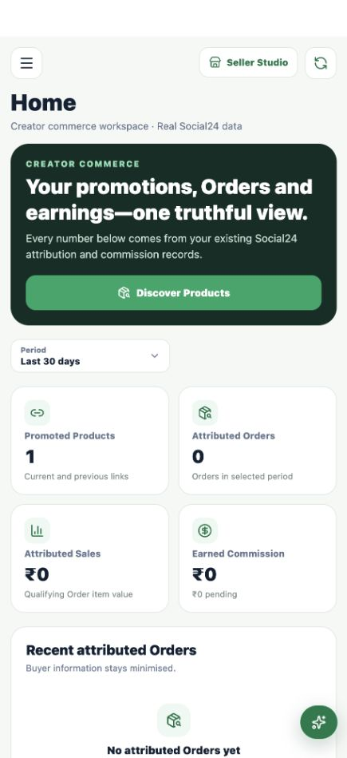
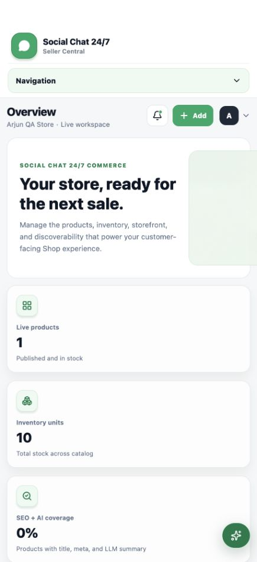
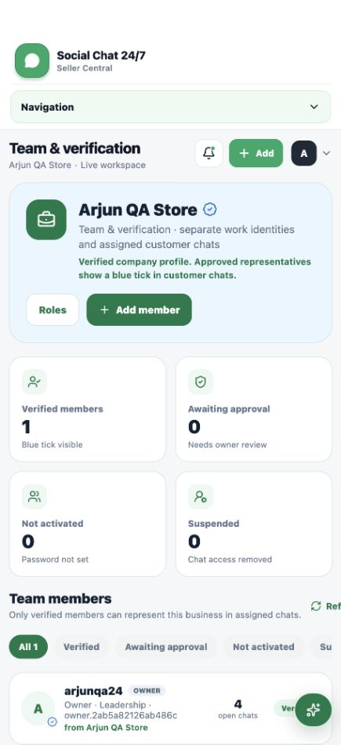
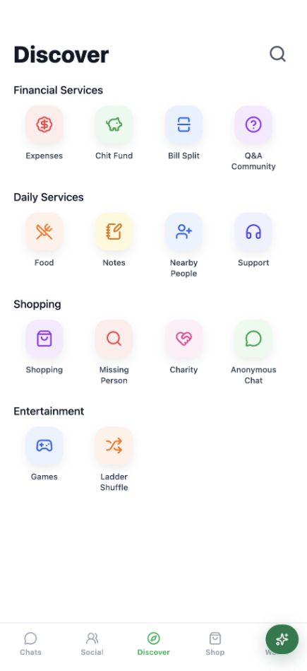
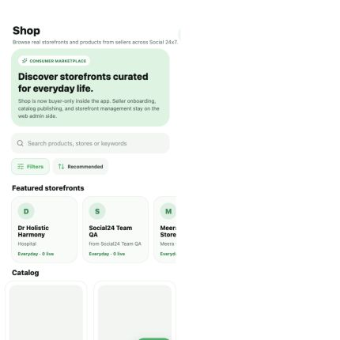
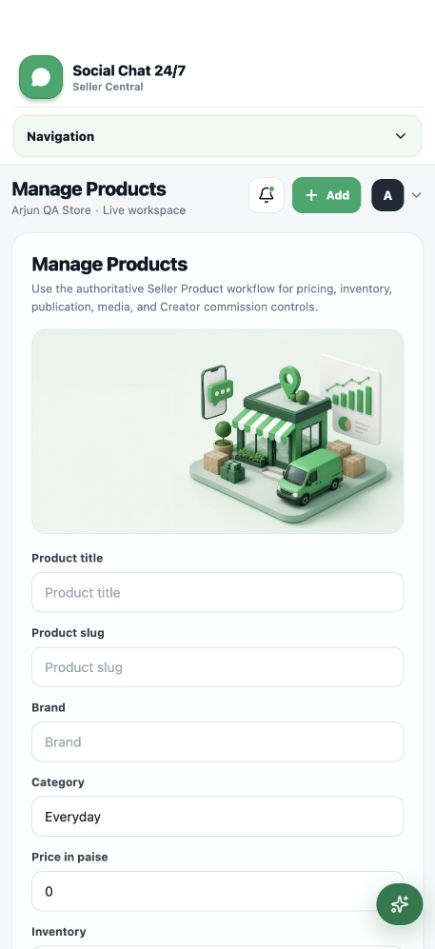
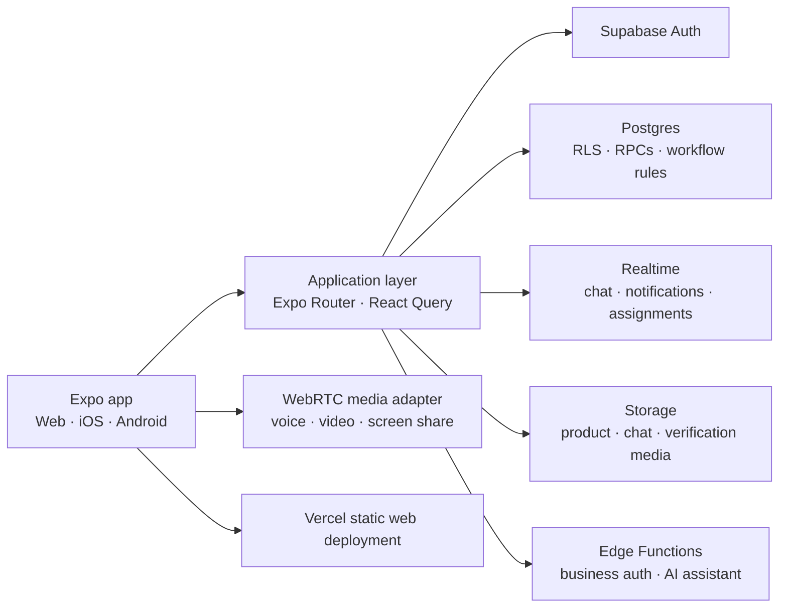

# Social24x7

Social24x7 is a cross-platform social, communication, and creator-commerce application that brings consumer conversations, content discovery, marketplace buying, creator promotion, and seller operations into one product.

Built with Expo and React Native for web and mobile, the app uses Supabase for authentication, Postgres data, row-level authorization, media storage, realtime updates, and server-side functions.

**[Live demo](https://vamshi-superapp-drchirag-social24x7.vercel.app)** · **[Repository](https://github.com/dingdong-vamshi/vamshi-superapp-drchirag-social24X7-draft-1)** · **Admin and approved role demos available on request**

<p align="center">
  
  
  
</p>

## Why this product exists

Social platforms usually split discovery, messaging, communities, creator monetization, and seller operations across separate tools. Social24x7 explores a single identity and data model for those workflows: a user can move from social discovery to a private or business conversation, browse a storefront, place an order, promote a product, or operate a seller workspace without leaving the platform.

## Product areas

| Area | Implemented experience |
| --- | --- |
| Social | Profiles, feed posts, stories, follows, reactions, comments, sharing, notifications, and discovery utilities |
| Communication | Personal and group chat, business conversations, media and documents, reactions, polls, events, memos, scheduled messages, vanish mode, and web call/screen-share adapters |
| Buyer commerce | Storefront and product discovery, search and filters, wishlist, cart, checkout, order history, delivery evidence, and return requests |
| Creator commerce | Creator onboarding, eligible-product discovery, tracked promotion links, attributed orders, commission reporting, and growth analytics |
| Seller operations | Storefront setup, catalogue and inventory, product media and approval, orders, fulfilment, returns, finance summaries, analytics, and creator conversations |
| Business teams | Separate employee work identities, activation and approval, built-in and custom roles, granular permissions, customer-chat assignment, monitoring, reassignment, suspension, and audit history |
| Trust and safety | Authenticated role gates, Postgres row-level security, private storage policies, verification states, minimized buyer data, and server-authorized workflow transitions |

> This is a portfolio build with production-style boundaries. Payment, KYC, settlement, and logistics integrations are exercised through controlled test flows; modules that do not yet have an authoritative workflow are visibly marked as coming soon.

## Product tour

<table>
  <tr>
    <td align="center"><strong>Discover</strong><br /></td>
    <td align="center"><strong>Buyer marketplace</strong><br /></td>
    <td align="center"><strong>Catalogue management</strong><br /></td>
  </tr>
  <tr>
    <td align="center"><strong>Seller Studio</strong><br /></td>
    <td align="center"><strong>Creator Center</strong><br /></td>
    <td align="center"><strong>Team &amp; Verification</strong><br /></td>
  </tr>
</table>

## Engineering depth

- **Authorization beyond UI guards:** business, chat, commerce, and team rules are enforced through Postgres functions, constraints, storage policies, and RLS—not only hidden buttons.
- **Realtime state:** messages, reactions, read state, assignments, member status, and business workflow changes subscribe to Supabase Realtime rather than relying on aggressive polling.
- **Workflow integrity:** product approval, fulfilment, returns, creator attribution, commissions, and employee reassignment use explicit server-authorized state transitions.
- **Media across platforms:** camera/gallery intake, document handling, image processing, thumbnails, signed private media access, and web-compatible voice/video call lifecycle code share one Expo codebase.
- **Identity separation:** personal accounts, buyers, creators, sellers, administrators, and company employees have different scopes while retaining historical attribution and audit records.
- **Production diagnostics:** contract tests cover auth, chat, calling, commerce, creator lifecycle, Seller Studio, team management, AI actions, games, social, wallet, and nearby discovery.

## Architecture



## Technology

| Layer | Stack |
| --- | --- |
| Client | Expo 57, React Native 0.86, React 19, Expo Router, TypeScript |
| Data and caching | Supabase JS, TanStack Query, AsyncStorage |
| Backend | Supabase Auth, Postgres, SQL/RPC functions, Edge Functions |
| Realtime and media | Supabase Realtime, Supabase Storage, WebRTC browser APIs, Expo Camera/Image Picker/Video |
| UI and analytics | Lucide React Native, React Native SVG, Recharts |
| Quality | TypeScript checks and Node's built-in test runner with feature-level contract suites |
| Deployment | Vercel static web export; Expo-compatible iOS and Android codebase |

## Try it in 1–2 minutes

Open the **[live application](https://vamshi-superapp-drchirag-social24x7.vercel.app)**. To avoid exposing shared production-like data, privileged or reusable public passwords are intentionally not stored in this repository.

1. **Buyer/social:** create a non-privileged account with your own email, confirm it, then open Discover, Shop, a storefront, and the cart flow.
2. **Seller:** request an approved demo, then open Seller Studio to review storefront readiness, catalogue, inventory, orders, and returns.
3. **Creator:** request an approved demo, then open Creator Center to inspect product discovery, tracked promotions, attribution, and commissions.
4. **Business teams:** request the owner/employee demo to see work-login activation, custom permissions, supervised customer chat, and atomic reassignment.

Admin access is available on request; it is not published because review queues can expose production-like QA records.

## What I built

This repository demonstrates end-to-end product engineering across a large Expo application: reusable mobile/web UI, authentication and session recovery, a normalized Supabase schema, RLS and storage authorization, realtime chat, media pipelines, role-specific commerce workspaces, creator attribution, order and return state machines, business team permissions, AI-assistant action confirmation, automated regression coverage, and production deployment/QA.

The implementation is backed by versioned SQL migrations and focused repositories rather than static dashboard mock data. Security-sensitive actions—such as reading a conversation, changing a role, assigning a customer chat, publishing a product, or approving a return—are checked at the backend boundary.

## Local development

```bash
git clone https://github.com/dingdong-vamshi/vamshi-superapp-drchirag-social24X7-draft-1.git
cd vamshi-superapp-drchirag-social24X7-draft-1
npm install
cp .env.example .env.local
npm run web
```

Set the public Supabase URL and publishable key in `.env.local`; never place a service-role key or provider secret in an `EXPO_PUBLIC_*` variable.

Useful checks:

```bash
npx tsc --noEmit
npm run test:auth
npm run test:chat
npm run test:creator-commerce
npm run test:checkout
npm run test:seller-studio
npm run test:team
```

---

Social24x7 is an actively developed portfolio project. Screenshots show sanitized QA workspaces from the current deployed build.
